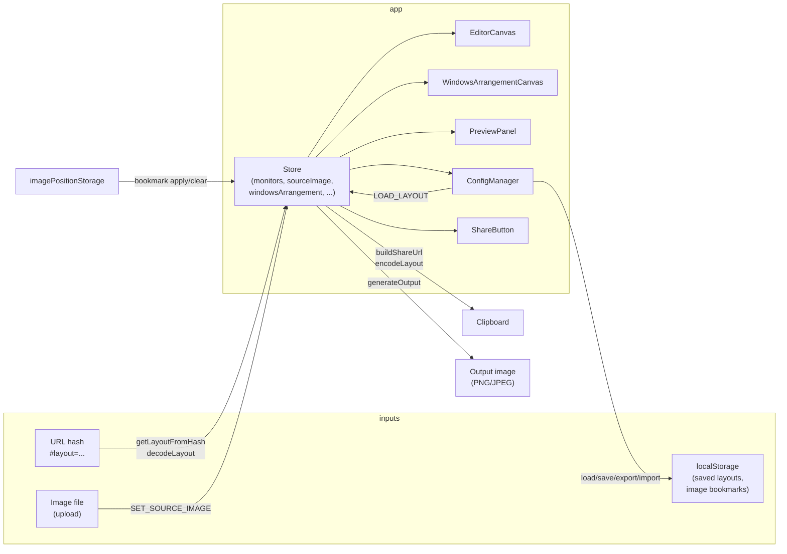

# Spanright — Architecture & Design

**Last updated:** 2025-02-20 (responsive/mobile shell added)

This document describes the structure and design of Spanright so that maintainers, collaborators, and tooling (including AI) can reason about the codebase. If the app has changed since the date above, this file may be outdated and should be refreshed.

---

## 1. What the app does

Spanright is a **single-page web app** for creating **pixel-perfect spanning wallpapers** for multi-monitor setups. The key idea:

- **Physical space (inches)** — Users arrange monitors on a canvas by real-world size (diagonal + resolution → PPI → physical width/height). A 27" monitor appears larger than a 15.6" laptop.
- **Virtual layout (pixels)** — Optional second step: match how the OS arranges displays (cursor/window movement). Output image is the bounding box of this arrangement; each monitor gets a crop at its native PPI.
- **No backend** — All logic runs in the browser (React + Konva). Layout and image position can be shared via URL hash (LZ-compressed) or saved in localStorage.

See [README.md](./README.md) for user-facing features, directions, and platform notes.

---

## 2. Tech stack

| Layer        | Choice |
|-------------|--------|
| UI          | React 19 + TypeScript |
| Canvas      | Konva + react-konva (physical and virtual layout canvases) |
| Styling     | Tailwind CSS 4 |
| Build       | Vite 7 |
| State       | Single React Context + `useReducer` (no Redux/Zustand) |
| Persistence | `localStorage` (saved layouts, image position bookmarks); URL hash for share links |

---

## 3. Entry point and provider tree

```
index.html
  └── <div id="root">
        └── main.tsx
              └── <App />  (StoreProvider → ToastProvider → AppContent)
```

- **main.tsx** — Mounts `App` into `#root`; imports `index.css` (Tailwind).
- **App.tsx** — Wraps the app in `StoreProvider` and `ToastProvider`; renders header, tabs (Physical Layout | Virtual Layout | Preview & Export), and tab content. Also handles:
  - **URL hash on load:** `getLayoutFromHash()` → if present, `LOAD_LAYOUT` and `clearLayoutHash()`.
  - **First visit:** Welcome dialog (key `spanright-welcome-seen` in localStorage).
  - Modals: About, Welcome/Quick Start, How It Works (InfoDialog), Troubleshooting Guide.

---

## 4. State (store)

**File:** `src/store.tsx`

Single source of truth: one `useReducer` (with undo/redo wrapper) exposed via `StoreProvider` and `useStore()`.

### 4.1 Main state slices

| Slice | Purpose |
|-------|--------|
| `monitors` | Physical layout: each has `id`, `preset`, `physicalX/Y`, `physicalWidth/Height`, `ppi`, `rotation`, `displayName`, `bezels`. |
| `sourceImage` | Uploaded image + transform in physical space (position, size, rotation). |
| `canvasScale`, `canvasOffsetX/Y` | Pan/zoom of the physical canvas (pixels per inch; limits in store constants). |
| `windowsArrangement` | Virtual layout: `{ monitorId, pixelX, pixelY }[]`. When `useWindowsArrangement` is false, this is regenerated from physical order (left-to-right, top-aligned). |
| `activeTab` | `'physical' \| 'windows' \| 'preview'`. |
| `fillMode`, `fillSolidColor` | How to fill empty output area (solid, blur, transparent). |
| `activeLayoutName`, `loadedLayoutImagePosition` | Set when loading/saving a layout; used for image position restore and bookmark key. |
| Undo/redo | `_undoStack`, `_redoStack`, `_continuousKey` (internal). Snapshots include monitors, sourceImage, windowsArrangement, useWindowsArrangement, selectedMonitorId. |

### 4.2 Key actions (examples)

- **Layout:** `ADD_MONITOR`, `REMOVE_MONITOR`, `MOVE_MONITOR`, `ROTATE_MONITOR`, `DUPLICATE_MONITOR`, `SET_MONITOR_BEZELS`, `SET_MONITOR_DISPLAY_NAME`, `LOAD_LAYOUT`, `CLEAR_ALL_MONITORS`.
- **Image:** `SET_SOURCE_IMAGE`, `CLEAR_SOURCE_IMAGE`, `MOVE_IMAGE`, `SCALE_IMAGE`, `SET_IMAGE_TRANSFORM`, `ROTATE_SOURCE_IMAGE`.
- **Canvas:** `SET_CANVAS_SCALE`, `PAN_CANVAS`, `SET_CANVAS_OFFSET`; `TOGGLE_SNAP`, `TOGGLE_SMART_ALIGN`, `SET_GRID_SIZE`.
- **Virtual:** `SET_USE_WINDOWS_ARRANGEMENT`, `MOVE_WINDOWS_MONITOR`, `SYNC_WINDOWS_ARRANGEMENT`.
- **UI/Modals:** `SET_ACTIVE_TAB`, `SET_SHOW_HOW_IT_WORKS`, `SET_SHOW_TROUBLESHOOTING_GUIDE`, `SET_EYEDROPPER_ACTIVE`, `SET_PRESETS_SIDEBAR_COLLAPSED`.
- **Undo/redo:** `UNDO`, `REDO`.

---

## 5. Data flow (high level)



- **URL → app:** On load, `App` reads `#layout=ENCODED`. `urlLayout.getLayoutFromHash()` → `decodeLayout(encoded)` returns `{ monitors, imagePosition }` (LZ or base64url); `LOAD_LAYOUT` is dispatched with both, then hash is cleared.
- **Share:** `ShareButton` uses `buildShareUrl(monitors, imagePosition?)`. Image position in the URL = current canvas image if present, else `loadedLayoutImagePosition` (so sharing right after loading a layout with no image still includes the layout’s position).
- **Saved layouts:** `ConfigManager` reads/writes a list of `SavedConfig` to localStorage; loading dispatches `LOAD_LAYOUT` with optional `imagePosition`. Preloaded (quick) layouts pass `imagePosition: null`.
- **Image position bookmarks:** `imagePositionStorage.ts` stores `SavedImagePosition` by layout key (`activeLayoutName` or `_default`). Used when applying a bookmark or when loading a layout that had an image (restore position on next upload).

### 5.1 Image position: full behavior

Single source of truth for “where the layout wants the image” is **`loadedLayoutImagePosition`** in the store. It is used when: (1) **uploading** an image (if set, place image there; else bookmark or center), (2) **saving** a layout with no image on canvas, (3) **sharing** when there is no image on canvas.

**When `loadedLayoutImagePosition` is set**

- **Load saved layout** (from list) → `LOAD_LAYOUT` with `config.imagePosition` → store sets `loadedLayoutImagePosition`.
- **Open shared link** → decode URL → `LOAD_LAYOUT` with `imagePosition` from URL → store sets `loadedLayoutImagePosition`.
- **Save layout** (with no image) → we save `state.loadedLayoutImagePosition` into the config.
- **Remove image** → `CLEAR_SOURCE_IMAGE` reducer sets `loadedLayoutImagePosition` to the position the image had (so “move → remove → save” keeps the moved position).

**When it is cleared / not set**

- **Load preloaded (quick) layout** → `LOAD_LAYOUT` with `imagePosition: null`.
- **CLEAR_LOADED_LAYOUT_IMAGE_POSITION** (if ever dispatched).

**Rules that must stay consistent**

1. **Share URL:** `imagePosition` = `state.sourceImage` position if present, else `state.loadedLayoutImagePosition`. (So “load layout → share with no image” still puts position in the link.)
2. **Save layout:** `imagePosition` = current image position if there is an image, else `loadedLayoutImagePosition`. (So “load link → save with no image” or “move → remove → save” both retain the right position.)
3. **Upload image:** Prefer `loadedLayoutImagePosition`, then bookmark for `activeLayoutName`, then center.

---

## 6. Coordinate spaces

- **Physical (inches):** Canvas grid. 1 unit = 1 inch. Bounds in `canvasConstants.ts` (e.g. 0–144" × 0–96"). Monitor positions and image transform live here.
- **Pixel (output):** Each monitor has a rectangle in “virtual desktop” pixel space (`pixelX`, `pixelY`, width/height from resolution and rotation). Output image = bounding box of all monitors; empty regions use fill mode (solid/blur/transparent).

PPI and physical size: `utils.ts` (and store when creating monitors) use `ppi = sqrt(rx² + ry²) / diagonal`, then `physicalWidth = resolutionX / ppi`, `physicalHeight = resolutionY / ppi`.

---

## 7. File and directory map

| Path | Role |
|------|------|
| **Entry & app** | |
| `index.html` | Shell; mounts app via `main.tsx`. |
| `src/main.tsx` | React root; renders `App`. |
| `src/App.tsx` | Providers; header; tabs; tab content (EditorCanvas + sidebar, WindowsArrangementCanvas, PreviewPanel); modals; URL-hash load + welcome. |
| **State & types** | |
| `src/store.tsx` | Global state (reducer + undo/redo), `StoreProvider`, `useStore`, canvas scale constants. |
| `src/types.ts` | `Monitor`, `MonitorPreset`, `SourceImage`, `WindowsMonitorPosition`, `SavedConfig`, `SavedImagePosition`, `FillMode`, `ActiveTab`, etc. |
| **Core logic** | |
| `src/utils.ts` | PPI/physical size helpers; `createMonitor`; display name resolution. |
| `src/presets.ts` | Built-in monitor presets (laptops, standard, ultrawide, etc.). |
| `src/canvasConstants.ts` | Physical canvas bounds (inches) and center (for preloaded layout centering). |
| `src/generateOutput.ts` | Stitching: rotated image canvas, per-monitor crop at native PPI, placement by `windowsArrangement`, fill for empty area. |
| **Layout encoding & persistence** | |
| `src/urlLayout.ts` | Encode/decode layout and optional image position for share URL (compact JSON → LZ or base64url); `getLayoutFromHash` returns `{ monitors, imagePosition }`; `buildShareUrl`, `setLayoutHash`, `clearLayoutHash`. |
| `src/viewportConstants.ts` | Breakpoints for responsive layout (phone &lt;768px, tablet 768–1024, desktop ≥1024). |
| `src/useViewport.ts` | Hook returning `{ width, height, isPhone, isTablet, isDesktop }` with resize listener. |
| `src/preloadedLayouts.ts` | Optional quick-layout list (name + encoded string); `decodePreloadedLayout`. |
| `src/imagePositionStorage.ts` | localStorage get/set/delete for image position bookmarks by layout key; `formatAspectRatioLabel`. |
| **Components** | |
| `src/components/EditorCanvas.tsx` | Physical layout: Konva stage, monitors + image, pan/zoom, drag, selection, context menus, align assist, fit, eyedropper. |
| `src/components/WindowsArrangementCanvas.tsx` | Virtual layout: arrange monitors in pixel space; toggle “Use custom arrangement” and “Sync from physical”. |
| `src/components/MonitorPresetsSidebar.tsx` | Preset list + custom monitor form; add by click or drag onto canvas. |
| `src/components/Toolbar.tsx` | Top bar: unit toggle, zoom, fit, align assist, grid, saved layouts dropdown (ConfigManager), Share Layout (ShareButton), upload (ImageUpload), clear. |
| `src/components/PreviewPanel.tsx` | Live preview canvas from `generateOutput`; fill mode/color; eyedropper; download PNG/JPEG; troubleshooting link. |
| `src/components/ImageUpload.tsx` | File input; creates `SourceImage` and dispatches `SET_SOURCE_IMAGE`; applies `loadedLayoutImagePosition` when relevant. |
| `src/components/ConfigManager.tsx` | Saved layouts: load, save, delete, export JSON, import JSON; quick layouts from preloaded; integrates with store and localStorage. |
| `src/components/ShareButton.tsx` | Builds share URL from current monitors and image position (when present) via `buildShareUrl`, copies to clipboard. |
| `src/components/MobileShell.tsx` | Phone (&lt;768px) informational view: hero, read-only layout summary from URL hash, “open on desktop” message, “Open full editor” button. |
| `src/components/Toast.tsx` | Toast provider and trigger (success/error). |
| `src/components/InfoDialog.tsx` | “How it works” content. |
| `src/components/TroubleshootingGuide.tsx` | Wallpaper setup / troubleshooting modal. |
| `src/icons.tsx` | Shared SVG icon components. |
| **Styles** | |
| `src/index.css` | Tailwind imports. |
| **Scripts (dev)** | |
| `scripts/center-preloaded-layouts.mjs` | Centers layout strings at canvas center when adding preloaded layouts. |
| `scripts/measure-layout-encoding.mjs` | Compares base64url vs LZ layout encoding length. |

---

## 8. Component hierarchy (by tab)

- **Physical Layout tab:**  
  `Toolbar` (includes ConfigManager, ShareButton, ImageUpload) → flex row: `EditorCanvas` (main canvas) + `MonitorPresetsSidebar`.

- **Virtual Layout tab:**  
  `WindowsArrangementCanvas` only (uses same `monitors` and `windowsArrangement` from store).

- **Preview & Export tab:**  
  `PreviewPanel` (reads store and calls `generateOutput` for preview and download).

Modals (About, Welcome, InfoDialog, TroubleshootingGuide) are rendered in `App` and toggled by local state or store (`showHowItWorks`, `showTroubleshootingGuide`).

---

## 9. Key types (where they matter)

| Type | Defined in | Used for |
|------|------------|----------|
| `Monitor` | `types.ts` | In-store physical monitors; includes preset, physical position/size, ppi, rotation, bezels. |
| `MonitorPreset` | `types.ts` | Name, diagonal, aspect ratio, resolution; from presets or custom. |
| `SourceImage` | `types.ts` | Element, dimensions, physical transform, rotation. |
| `WindowsMonitorPosition` | `types.ts` | Virtual layout: monitorId, pixelX, pixelY. |
| `SavedConfig` | `types.ts` | Persisted layout: name, monitors (preset + physicalX/Y, rotation, displayName, bezels), optional imagePosition. |
| `SavedImagePosition` | `types.ts` | x, y, width, height, aspectRatio (for restore/bookmark). |
| `LayoutEntry` | `urlLayout.ts` | One monitor in share/preload encoding (preset + physicalX/Y + optional rotation, displayName, bezels). |

---

## 10. Design decisions (for context)

- **Single global store:** No Redux; one reducer + Context keeps data flow simple and undo/redo in one place.
- **Physical-first, virtual optional:** Default virtual arrangement is derived from physical (left-to-right, top-aligned). User can override in Virtual Layout tab.
- **Share via hash:** Layout encoded in `#layout=...` so links are self-contained; LZ compression keeps URLs shorter; legacy base64url still decoded.
- **No backend:** All state and output generation in the browser; persistence is localStorage + URL.
- **Konva for both canvases:** Same stack for physical and virtual layout for consistency and drag/zoom behavior.

---

*End of architecture document. When making significant structural changes, update this file and the “Last updated” date.*
